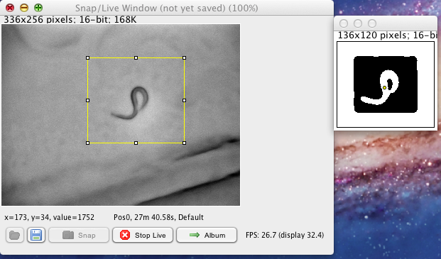
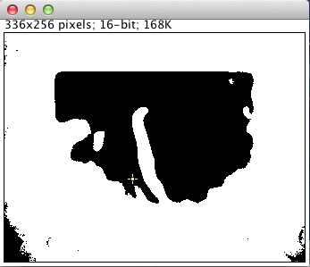
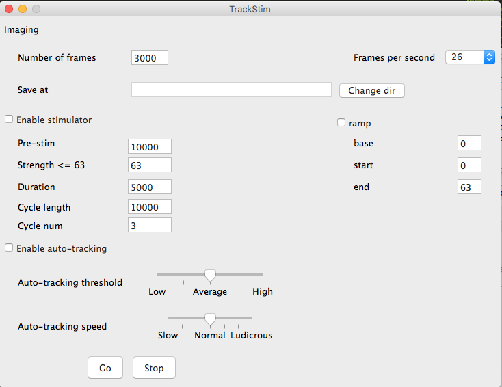

## Using TrackStim for Behaviour and Optogenetics Analysis

### Ensure the system components are on
1.  Turn on the mac 
2.  Turn on the microscope
3.  Turn on the automated stage
4.  Turn on the camera controller

### Ensure that the system components are all connected
See the following diagram for how the system should be set up


### Configuring the system for behaviour/optogenetics
1. Take the dual view splitter out half way
2. Move the dual view splitter switch to the left
3. Use the dark field filter cube setting "5" on the wheel under the eye piece
4. Place the LED light under the microscope stage if needed

### Opening the program
1.  Open the TrackStim-Behaviour program
2.  Choose the "TrackStim-BEHAVIOUR.cfg" config
3.  Click on the "Default" preset in the micromanager window
4.  Click the micromanager live window
5.  Click micromanager -> Plugins -> TrackStim

### Adjust the live image 
Adjust the live image so that your recordings look the way you want them to.

### Configuring the Auto-tracker to track the worm
When starting TrackStim, you will see another window appear.  This is the Tracker view.  Your goal is to get the Tracker view to look like this:


The worm should be fully white and the background should be fully black.  You will also see a marker that can be in any position on the screen.  In the above case, the marker is on the worm meaning it will track it when the stage moves. 


#### Tracking mechanisms
There are two mechanisms for tracking the worm provided by TrackStim.  They are the threshold slider, and the roi(region of interest) picker

##### Roi picker
To use the roi picker:
1. click and drag on the micromanager live window to create a roi
2. you should see the roi updated in the TrackerView
3. you can adjust the roi by dragging the squares at the bounds
4. ***Note: Make sure you make the roi near the center of the screen or camera won't capture the worm at center of the image***



General tips:
- a larger roi will reduce tracking errors at the cost of potentially introducing noise into the image
- a smaller roi will reduce noise in the image at the cost of potentially losing the worm if it goes too fast
- use this in conjunction with the threshold slider, and the tracker speed slider to optomize tracking performance


##### Threshold slider
To use the thresold slider:
1. drag the slider on the TrackStim ui
2. the tracker view should be updated to reflect the new threshold value



General tips:
- a lower threshold value may get the whole worm body, but also introduce more noise into the image (see above)
- use this in conjunction with thte roi picker to optomize tracking performance
- z focus on the worm may require different threshold values, lower/increase the threshold as needed while imaging

### UI Guide
***Note*** the UI in the picture may not be exactly the same as the current UI due to the ongoing work of TrackStim




##### Imaging options
Control how many frames to take, frames per second, and where to save the images
- ```Number of frames```: number of frames to take
- ```Frames per second```: how many frames per second to take
- ```Save at```: where to save the images

##### Stimulator options
Control the LED light and turn it on/off programmatically
- ```Enable stimulator```: must be enabled for the following options to work
- ```Pre-stim```: duration in ms before the first light cycle starts
- ```Strength```: LED strength - must be in the range of [1. 63]
- ```Duration```: duration that the light is on each cycle in ms
- ```Cycle length```: total cycle length in ms
- ```Cycle num```: number of cycles
- ```ramp```: enable ramping the light up i.e instead of full strength, gradually ramp up light intensity
- ```base```: base signal strength 
- ```start```: signal strength to start at each cycle
- ```end```: signal strength to end at each cycle

##### Auto-tracking options
Controls settings related to the Tracker view and the tracking speed
- ```Enable auto-tracking```: must be enabled for the following options to work
- ```Auto-tracking threshold```: value used to threshold the Tracker view, see the threshold slider section for more information
- ```Auto-tracking speed```: set how fast the stage should move.  (dauer worms and stimulated worms may need higher than normal speed)

#### Main controls
- ```Go```: starts imaging with the current options in the ui
- ```Stop```: stop imaging and cancel all stimulation, tracking, and imaging tasks
